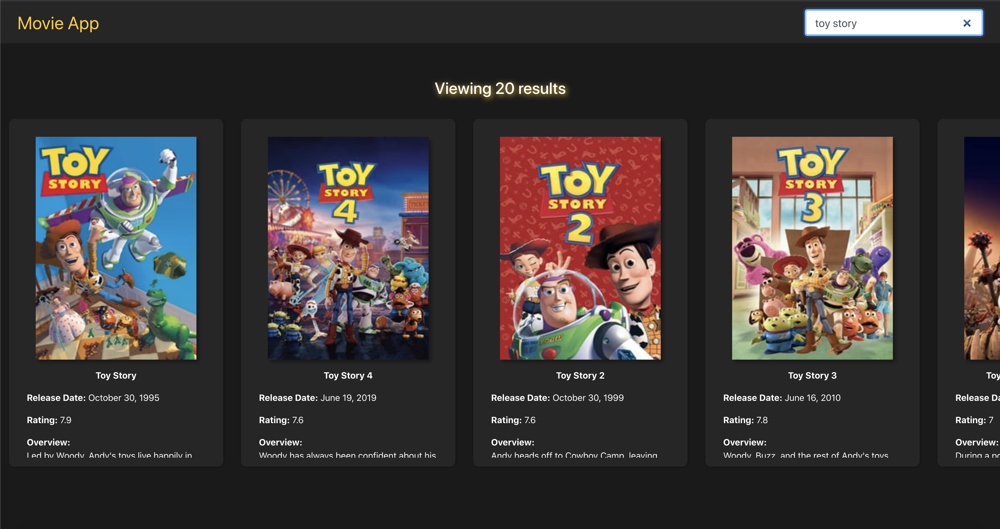
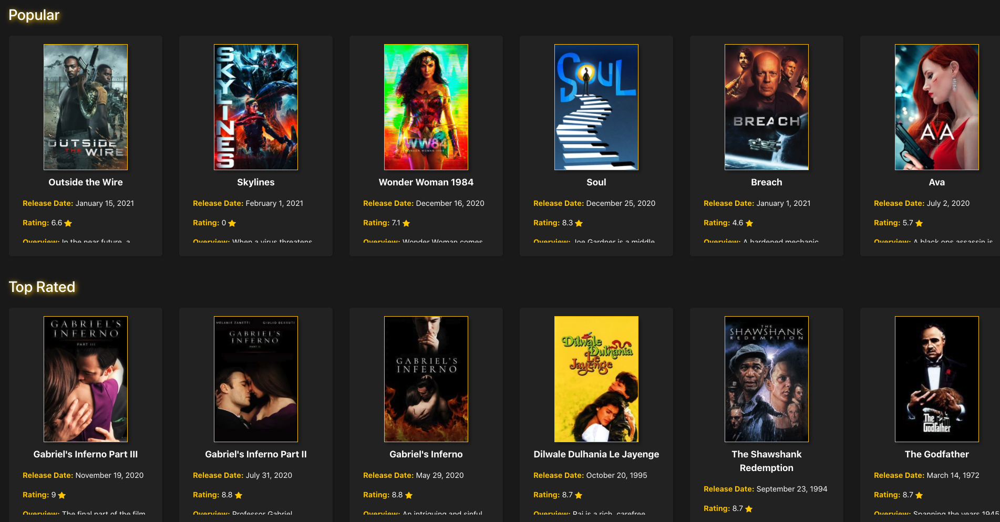

# React Movie App 

## Description 
This is an application using React as the framework and allows the user to search movies they want to watch from the MovieDB API. 

## Table of Contents
* [Installation](#installation)
* [Usage](#usage)
* [License](#license)
* [Contributing](#contributing)
* [Tests](#tests)
* [Questions](#questions)

## Installation 
No installation, this application is to be used on the browser. If wanting to work on contents of the application, user will need to clone the repo and install dependencies. 

## Usage 
This application will allow users to search for movies and will be able to click on them to view their MovieDB page. 
Please view deployed application on [Github Pages](https://nicolewallace09.github.io/react-movie-app/)
 
 

## License 
This project is license under MIT

## Contributing 
Contributors should read the installation section. 

## Tests
No tests are used in this application.

## Questions
If you have any questions about this projects, please contact me directly at nicole.elisaw@gmail.com. You can view more of my projects at https://github.com/nicolewallace09.